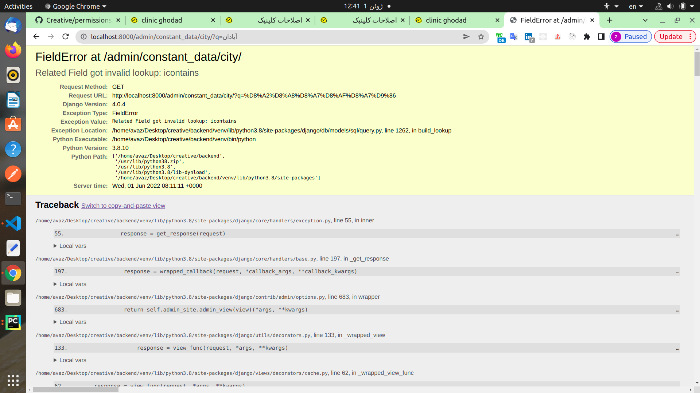

### FieldError at /admin/constant_data/city/


Django admin uses __icontaines to search, and fk fields don't have __icontaines
```python
# amin.py
class CityAdmin(admin.ModelAdmin):
    search_fields = ('name', 'fa_name', 'parent')
    list_display = ('name', 'fa_name', 'parent')
    ordering = ('name', 'parent',)

```

* solution: Remove fk fields from search fields
```python
# amin.py
class CityAdmin(admin.ModelAdmin):
    search_fields = ('name', 'fa_name', )
    list_display = ('name', 'fa_name', 'parent')
    ordering = ('name', 'parent',)

```
