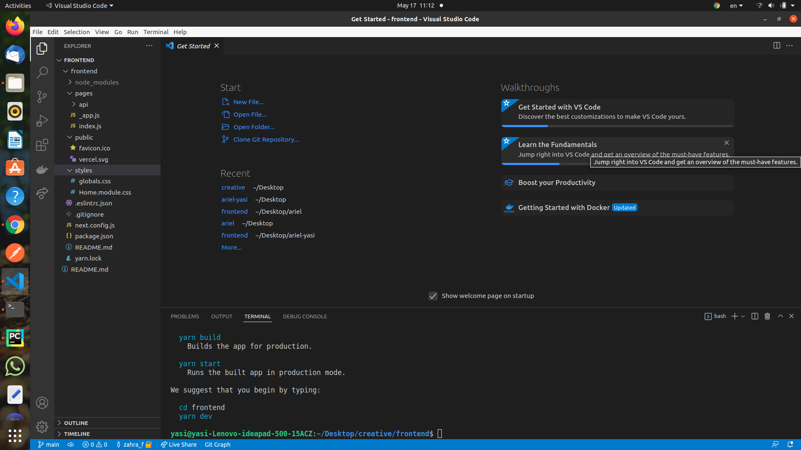

# Starting Project
## Setting up

```
npx create-next-app frontend
```



## Installing mui
[MUI Docs](https://mui.com/material-ui/getting-started/installation/)
```
cd frontend 
yarn add @mui/material @emotion/react @emotion/styled
```

## Installing sass
[NextJS docs](https://nextjs.org/docs/basic-features/built-in-css-support#sass-support)
```
npm install --save-dev sass
```


## Installing bootstrap
[BOOTSTRAP](https://medium.com/nextjs/how-to-add-bootstrap-in-next-js-de997371fd9c)
```
npm install bootstrap
```
* rename `styles/globals.css` to `styles/globals.scss`
* fix import `pages/_app.js` to `import '../styles/globals.scss'`
* create new file ` 
styles/_bootstrap-imports.scss
`
* create `styles/_colors.scss`
* create `styles/_fonts.scss`
* create `styles/_theme.scss`
* update `syles/global.scss` 

## create folder  for fonts 
* puplic/fonts
* register fonts in `styles/_fonts.scss`

## define colors
* `styles/_colors.scss`

## support persion

[i18n Nextjs docs](https://nextjs.org/docs/advanced-features/i18n-routing)
[LTR Support](https://github.com/vercel/next.js/discussions/19049)

* Add the following code to next.config.js
```js
const nextConfig = {
....
i18n: {
    // These are all the locales you want to support in
    // your application
    locales: ['ar'],
    // This is the default locale you want to be used when visiting
    // a non-locale prefixed path e.g. `/hello`
    defaultLocale: 'ar',
    // This is a list of locale domains and the default locale they
    // should handle (these are only required when setting up domain routing)
    // Note: subdomains must be included in the domain value to be matched e.g. "fr.example.com".
    // domains: [
    //   {
    //     domain: 'example.com',
    //     defaultLocale: 'en-US',
    //   },
    // ],
  },

  ...
}
```
* create `pages/_document.js`


## setup fonts in theme
* `styles/_theme.scss`

## install reacticons
[reacticons](https://react-icons.github.io/react-icons/)


## Loading SVG files as react components

[Toturial](https://dev.to/dolearning/importing-svgs-to-next-js-nna)

* We can use babel to load these svgs ([Plugin Link](https://www.npmjs.com/package/babel-plugin-inline-react-svg))
  * `npm install --save-dev babel-plugin-inline-react-svg
`
  * Add the following code to `.babelrc` (You may need to create it)
```json
{
  "plugins": [
    "inline-react-svg"
  ]
}
```
* if we run into problems we can use webpack SVGR plugin


# Layout
## fix layout
`pages/_app.js`

[layout](https://nextjs.org/docs/basic-features/layouts#per-page-layouts)

```jsx
export default function MyApp({ Component, pageProps }) {
  // Use the layout defined at the page level, if available
  const getLayout = Component.getLayout || ((page) => page)

  return getLayout(<Component {...pageProps} />)
}

```

## Run

You should be in the right folder before you start react. Your main folder which includes public,src, package.json 
```
npm run dev
```

## git
```
git branch --show-current
git config --list

```
