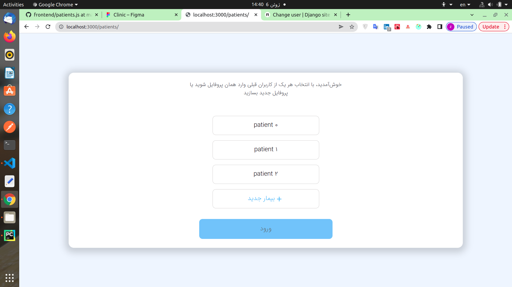
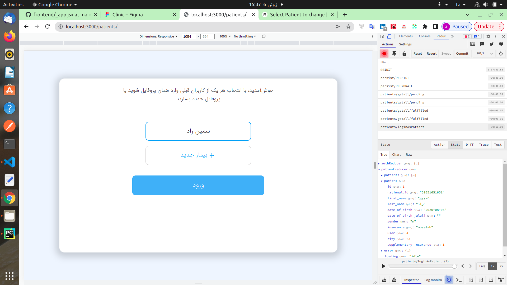
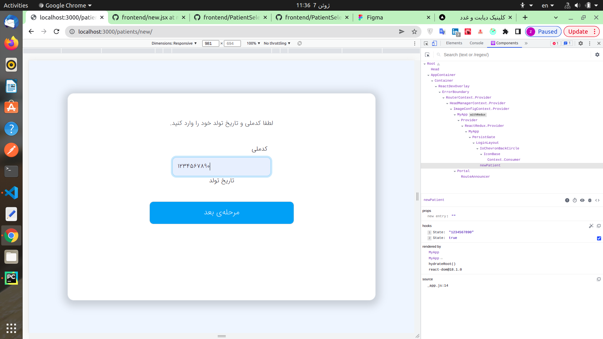
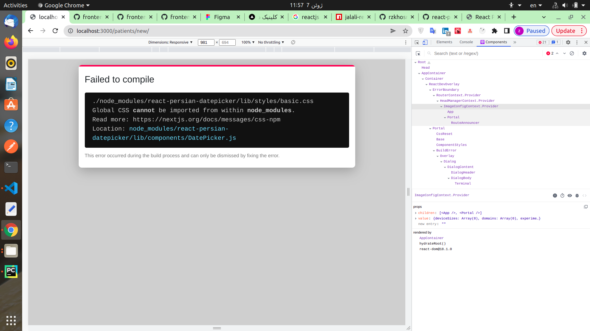

# map


```jsx
<div className={`d-flex flex-column p-3  align-items-center`}>
        {[0, 1, 2]
          .map((i) => ({
            id: i,
            first_name: "patient",
            last_name: i,
          }))
          .map((p) => (
            <div key={p.id}>
              <input
                type="radio"
                className={`btn-check ${styles.btn}`}
                name="patientselect"
                id={`patient_select_${p.id}`}
                autoComplete="off"
                onChange={() => selectPatient(p.id)}
                checked={selectedPatient === p.id}
              />
              <label
                className={`btn btn-outline-primary align-items-center justify-content-center m-2 ${
                  styles.btn
                } ${styles.sbtn}  ${
                  selectedPatient === p.id ? styles["sbtn-checked"] : ""
                }`}
                htmlFor={`patient_select_${p.id}`}
              >
                {p.first_name} {p.last_name}
              </label>
            </div>
          ))}
            <div className={`mt-2`}>
          <button
            className={`btn btn-outline-primary ${styles.btn} ${styles.btnsm} ${styles["text-light-blue"]}`}
            // onClick={() => {}}
            onClick={newPatient}
          >
            <AiOutlinePlus className={`m-1 ${styles["plus-icon"]}`} />
            بیمار جدید
          </button>
        </div>
      </div>
```

## redux patient
* patients.js => loadpatients, patientSlice
* store.js => register patientSlice
```js
const combinedReducers = combineReducers({
  ...
  patientReducer : patientsSlice.reducer, // Add this line
  ...
});
```
* patients/index.jsx
```jsx
  const patients = useSelector((state) => state.patientReducer?.patients);
  ...

```

## Setup axios interceptors and presist gate
We ran into 401 error and axios was not refreshing our token, so we added axios interceptors and redux persist gate

In _app.js
```jsx

function MyApp({ Component, pageProps }) {
...
  const store = useStore();
  setupInterceptors(store)

  return <PersistGate persistor={store.__PERSISTOR} loading={null}>

...
   </PersistGate>
}

```

# Selecting a patient

In order to save the selected patient so that it can be accessed in all pages, we can use Redux(you can also do it with localstorage and react context but we already have redux setup here so whats the point)

So we need a reducer that takes a patient_id and saves the corresponding patient's data in redux state.
This Reducer doesn't need an async action so we can use regular redux reducers for it.
```js
`lib/slice/patient.js`
export const patientsSlice = createSlice({
  name: 'patients',
  initialState: internalInitialState,
  reducers: {
    reset: () => internalInitialState,
    loginAsPatient: (state, action) => {
      state.patient = state.patients.filter((patient)=>(patient.id == action.payload))[0]
      return state
    }
  },
```
```js
`patients/index.js`
const submit = ()=>{
    dispatch(loginAsPatient(selectedPatient))
  }
```
state is the current state of redux that needs to be updated according to this action.
So we need to update the state according to action.type and action.payload.
in this instance action.payload the function parameter in dispatch(selectedPatient).


# Using css selectors instead of conditional rendering for showing selected patient
1. Conditional Rendeing
```jsx
 <input
  type="radio"
  className={`btn-check ${styles.btn}`}
  name="patientselect"
  id={`patient_select_${p.id}`}
  autoComplete="off"
  onChange={() => selectPatient(p.id)}
/>
<label
  className={`btn btn-outline-primary align-items-center justify-content-center m-2 ${
    styles.btn
  } ${styles.sbtn}  ${
    selectedPatient === p.id ? styles["sbtn-checked"] : ""
  }`}
  htmlFor={`patient_select_${p.id}`}
>
```
```scss
.btn {
  border: 1px solid $secondary-border;
  font-size: 1em;
  line-height: 1.5em;
  cursor: pointer;

  @include media-breakpoint-up(md) {
    font-size: 1.2em;
    line-height: 1.5em;
    width: 320px !important;
  }
}
.sbtn {
  text-align: center;
  color: black !important;
  border: 1px solid $secondary-border !important;
  background-color: $white !important;
  line-height: 2.25em;

  &:checked,
  &:active,
  &:focus,
  &:hover {
    border: 2px solid $primary !important;
    background-color: $white !important;
    -webkit-box-shadow: 0 0 0 0rem rgb(63 169 245 / 50%) !important;
    box-shadow: 0 0 0 0rem rgb(63 169 245 / 50%) !important;
  }

  &:hover {
    -webkit-box-shadow: 0 0 0 0.25rem rgb(63 169 245 / 50%);
    box-shadow: 0 0 0 0.25rem rgb(63 169 245 / 50%);
  }
}

.sbtn-checked {
  border: 2px solid $primary !important;
  background-color: $white !important;
  -webkit-box-shadow: 0 0 0 0rem rgb(63 169 245 / 50%) !important;
  box-shadow: 0 0 0 0rem rgb(63 169 245 / 50%) !important;
}

```

2. Css selecotrs
```jsx
 <input
  type="radio"
  className={`btn-check ${styles.btn}`}
  name="patientselect"
  id={`patient_select_${p.id}`}
  autoComplete="off"
  onChange={() => selectPatient(p.id)}
  checked={selectedPatient === p.id}
/>
<label
  className={`btn btn-outline-primary align-items-center justify-content-center m-2 ${styles.btn} ${styles.sbtn1}`}
  htmlFor={`patient_select_${p.id}`}
>
```
```scss
.btn {
  border: 1px solid $secondary-border;
  font-size: 1em;
  line-height: 1.5em;
  cursor: pointer;

  @include media-breakpoint-up(md) {
    font-size: 1.2em;
    line-height: 1.5em;
    width: 320px !important;
  }
}
.sbtn1 {
  text-align: center;
  color: black !important;
  border: 1px solid $secondary-border !important;
  background-color: $white !important;
  line-height: 2.25em;

  .btn:checked + & { /// IMPORTANT
    border: 2px solid $primary !important;
    background-color: $white !important;
    -webkit-box-shadow: 0 0 0 0rem rgb(63 169 245 / 50%) !important;
    box-shadow: 0 0 0 0rem rgb(63 169 245 / 50%) !important;
  }

  &:hover {
    -webkit-box-shadow: 0 0 0 0.25rem rgb(63 169 245 / 50%);
    box-shadow: 0 0 0 0.25rem rgb(63 169 245 / 50%);
  }
}

```


# new patient
## nationalId validation

```jsx
import React, { useState, useEffect, useRef } from "react";

function newPatient() {
  // const nationalId = useRef();
  const [nationalId, setnationalId] = useState();
  const [nationalIdValid, setNationalIdValid] = useState(false);
  return (
    <form
      onSubmit={(e) => e.preventDefault()}
      className="mt-5"
    >
     ...
      <div className="d-flex flex-column p-3 align-self-center align-items-center w-100">
        <div className="align-items-right">
          <label className="form-label" htmlFor="nationalId">
            کدملی
          </label>
          <input
            dir="ltr"
            id="nationalId"
            // ref={nationalId}
            className="form-control"
            maxLength={10}
            value={nationalId}
            onChange={(e) => {
              setnationalId(e.target.value);
              setNationalIdValid(e.target.value.length === 10); // important
            }}
            inputMode="numeric"
          />
       
        </div>
      </div>
      <div className={`d-flex flex-row p-3 align-self-center ${styles.submit_div}`}  >  
        <button
          type="submit"
          className={`btn btn-primary flex-fill ${styles.btn}`}
          disabled={nationalIdValid} /// important
          // onClick={submit}
        >
          مرحله‌ی بعد
        </button>
      </div>
    
    </form>
  );
}

export default newPatient;


```
## Have 2 state



## datepicker
[datepicker](https://www.npmjs.com/package/react-persian-datepicker)
```commandline
npm i react-persian-datepicker
npm uninstall react-persian-datepicker # Nextjs doesn't allow global css in components
```


[jalali-react-datepicker](npmjs.com/package/jalali-react-datepicker)
```
npm i jalali-react-datepicker
```

```jsx
import { DatePicker } from "jalali-react-datepicker";
 <DatePicker
            value={birthdate}
            timePicker={false}
            onClickSubmitButton={({ value }) => setBirthDate(value)}
          />

```